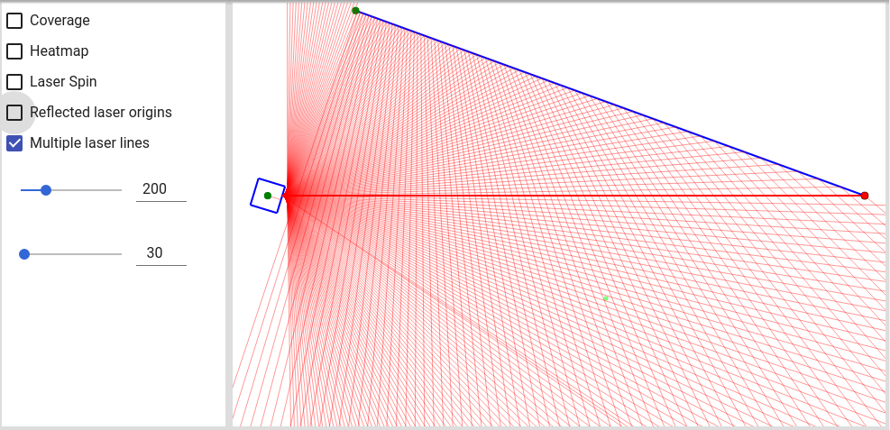

# Finger Mouse

A hardware project to create a multi-finger tracking device.

## Concept

A mouse with articulation points for several fingers, where the position of each finger-tip is tracked using the timing of laser sweeps.

## Mockup and Simulation tool

The simulation and mockup tool allows components to be interactively moved around to find optimum configurations.

[Launch Simulation Tool](https://joshua-shone.github.io/finger-mouse).

## Geometry

